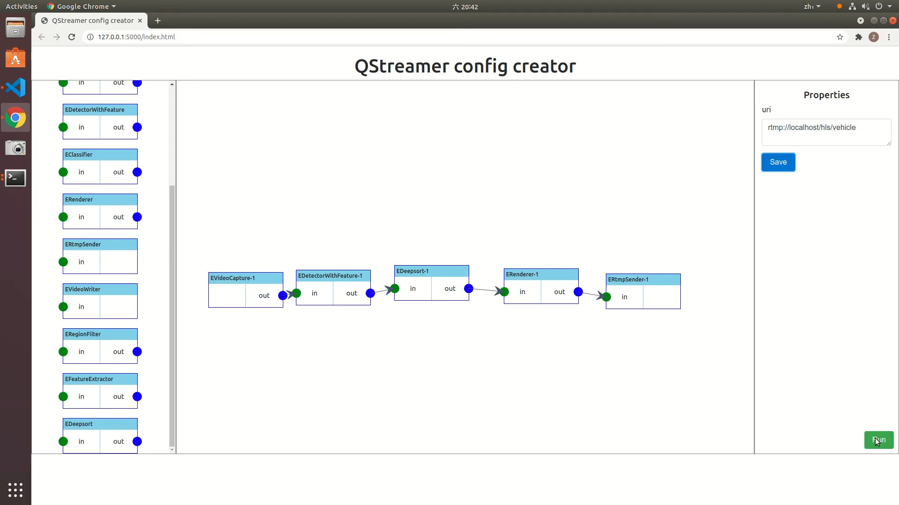
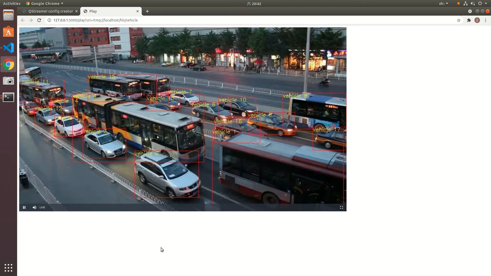
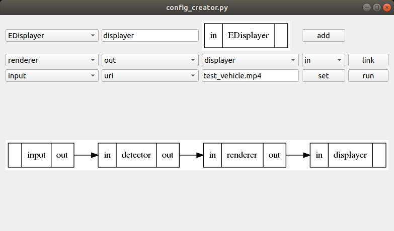

# QStreamer: A simple multimedia framework imitating GStreamer

## Preparation

### Dependencies

- g++8
- CMake
- OpenCV
- CUDA
- TensorRT
- Node.js & npm

### Python dependencies

```bash
sudo apt install graphviz
pip install -r requirements.txt
```

### Build QStreamer

```bash
mkdir build
cd build
cmake ..
make
```

### Build js file

```bash
cd config_creator_js
npm install
npm run all
```

## Usage

### Web interface

Start web server

```bash
python server.py
```

Visit [http://127.0.0.1:5000/index.html](http://127.0.0.1:5000/index.html) to build pipeline



Click "Run" button to run the pipeline



[Click to see demo video](snapshots/demo.mp4)

### Python interface

Build pipeline

```bash
python config_creator.py
```

Snapshot

